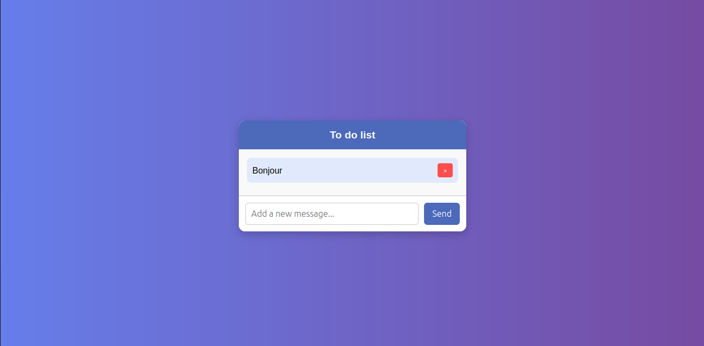

# To-Do List in PHP




## 📌 Overview
This is a simple To-Do List web application built with PHP, MySQL, HTML, and CSS. Users can add tasks, view them in a list, and delete completed tasks. The application stores tasks in a MySQL database and dynamically updates the task list.

## 🚀 Features
- Add new tasks
- Display all tasks
- Delete tasks
- Persistent storage using MySQL database

## 🛠 Technologies Used
- PHP
- MySQL
- HTML
- CSS

## 📂 Project Structure
```
📁 project-root
│-- 📁 config
│   ├── config.php  # Database connection
│-- 📁 css
│   ├── styles.css  # Styling for the app
│-- 📁 queries_SQL
│   ├── add_query.php  # Handles adding tasks
│   ├── delete_query.php  # Handles deleting tasks
│-- 📁 public
│   ├── index.php  # Main To-Do List page
│-- README.md  # Documentation
```

## ⚙️ Setup Instructions

### 1️⃣ Clone the Repository
```bash
git clone https://github.com/yourusername/todo-list-php.git
cd todo-list-php
```

### 2️⃣ Database Configuration
1. Create a MySQL database (e.g., `todo_db`).
2. Import the following table structure:
```sql
CREATE TABLE messages (
    id INT AUTO_INCREMENT PRIMARY KEY,
    message TEXT NOT NULL,
    created_at TIMESTAMP DEFAULT CURRENT_TIMESTAMP
);
```
3. Update `config/config.php` with your database credentials:
```php
<?php
$host = "localhost";
$dbname = "todo_db";
$username = "root";
$password = "";

try {
    $pdo = new PDO("mysql:host=$host;dbname=$dbname", $username, $password);
    $pdo->setAttribute(PDO::ATTR_ERRMODE, PDO::ERRMODE_EXCEPTION);
} catch (PDOException $e) {
    die("Connection failed: " . $e->getMessage());
}
?>
```

### 3️⃣ Run the Application
Start a local server using PHP:
```bash
php -S localhost:8000 -t public
```
Then, open [http://localhost:8000](http://localhost:8000) in your browser.

## 🎯 How It Works
1. **Add a Task**: Enter a task in the input field and click `Send`.
2. **View Tasks**: The task list updates dynamically.
3. **Delete a Task**: Click the `×` button next to a task to remove it.

## 📌 Future Improvements
- ✅ Edit tasks
- ✅ Mark tasks as completed
- ✅ User authentication
- ✅ Drag & Drop sorting